# NANDA Index — Level 1 Design Document

| | |
|---|---|
| Status | Draft — concept-locked, pre-implementation |
| Reference | `2507.14263v1` — *Beyond DNS: Unlocking the Internet of AI Agents via the NANDA Index and Verified AgentFacts* (Project NANDA, v0.3) |
| Companion | `NANDA-L1-PLAN.md` — build plan, module list, decisions, deep-dive sequence |
| Scope | Level 1 — end-to-end resolve + verify, two NANDA-native agents |

## 1. Purpose

This document is the architectural picture for the Level 1 NANDA prototype:
the problem it solves, the components that solve it, and the resolution flow
that ties them together. Build specifics — module layout, dependencies, tamper
tests, open decisions — live in the companion plan file.

## 2. Problem statement

DNS and TLS certificates do two jobs well: map a human-readable name to a
static endpoint, and prove domain ownership. Neither fits an internet of
autonomous agents:

- **Update velocity.** DNS assumes minute-to-hour change; agents may move
  endpoints every few seconds, and there may be billions of them. Pushing that
  churn through a DNS-style write path does not scale.
- **Trust semantics.** A certificate proves *ownership of a domain*. It says
  nothing about what an agent can do, whether its declared capabilities are
  real, or how to revoke it quickly.

The paper's answer is to **decouple identity from metadata** and bind both with
signatures: a tiny, mostly-static index record points to a richer, freely
updated metadata document, and each is independently signed.

## 3. Solution overview

Level 1 answers one question end-to-end: *can a client take an agent's name,
find it, trust what comes back, and use it — without DNS's limits?*

It does so with three runtime concerns, each changing at a different rate:

- **Stable identity** — a lean index maps a name to pointers (the AgentAddr).
- **Rich metadata** — an AgentFacts document holds capabilities and endpoints,
  hosted separately and signed as a Verifiable Credential.
- **Verification** — a shared crypto layer makes every record tamper-evident.

The paper's third tier — dynamic endpoint routing — is represented as a pointer
in Level 1 but exercised in Level 2.

## 4. Component architecture

The client is the only active party; the index and facts store are passive
stores it queries, and the crypto layer is the shared spine both stores sign
with and the client verifies against. Each component owns one sub-problem:

| Component | Module | Sub-problem it solves |
|---|---|---|
| Identity & naming | `types.ts` | Refer to an agent unambiguously and resolvably — a stable machine `agent_id` plus a human-readable `agent_name` URN. |
| Lean Index | `index-service.ts` | Find-by-name without a fat, write-heavy record — name to a tiny signed AgentAddr of pointers, never endpoints or capabilities. |
| Facts Store | `facts-store.ts` | House rich, fast-changing metadata without bloating the index — capabilities, skills, endpoints in a separate signed document. |
| Crypto / verification | `crypto.ts` | Trust and tamper-detection — Ed25519 Verifiable Credential proofs over every record. |
| Client + trust policy | `client.ts` | Walk the flow, enforce trust, act — orchestrate hops, check each signature and the issuer allowlist, then select an endpoint. |

## 5. Resolution flow

The client resolves a name at the index, verifies the returned AgentAddr,
fetches the AgentFacts it points to, verifies that too, applies trust policy,
and only then selects an endpoint to act on.

Two properties are the conceptual core of Level 1:

- **Two signers, two attack classes.** The index resolver signs the AgentAddr;
  a credential issuer signs the AgentFacts. Editing a capability breaks the
  *issuer's* proof; swapping `facts_url` to redirect a victim breaks the *index
  resolver's* proof. A single signature could not catch both — which is exactly
  the paper's argument for separating identity-routing from metadata.
- **The index is touched once per handshake.** Once the client holds a verified
  AgentAddr and AgentFacts, it talks to the agent directly; the index is not in
  the data path. This is the paper's N×N to 2N collapse, and the reason a lean,
  mostly-static index can serve agent-scale traffic.

## 6. Verification approach

Records are signed with **W3C VC 2.0 Data Integrity proofs using the
`eddsa-jcs-2022` cryptosuite** (Ed25519 over RFC 8785 / JCS-canonicalised
JSON), with `did:key` issuers. This is a real, registered VC cryptosuite, so
the records *are* Verifiable Credentials — but JCS canonicalisation avoids the
JSON-LD / RDF rabbit hole. One signer/verifier serves both record types. The
companion plan file holds the full spectrum analysis (bare JWS to full
`eddsa-rdfc-2022`) and the rationale for landing here.

## 7. Scope boundary — Level 1 vs Level 2

Built and visible above: name resolution, the AgentAddr and AgentFacts records,
two independent signatures, and tamper detection.

Deliberately deferred to Level 2 (the architecture leaves slots for each):

- The privacy path — `private_facts_url` exists as a pointer, but the client
  always takes the primary path.
- The adaptive resolver actually routing traffic.
- TTL-driven caching and credential revocation.
- Federated, cross-zone issuer trust replacing the flat allowlist.
- Mixed registration types — enterprise-routed and DID-routed agents.

## 8. Design decisions

Built up per component as the deep dive proceeds. Each entry records the choice,
the alternative it was taken over, and the cost.

### 8.1 Identity & naming

- **Two identifiers, not one** — keep a stable machine `agent_id` separate from a human `agent_name`, and both distinct from locators (AgentAddr pointers). Endpoints can churn without the identity ever changing.
- **`agent_id` = `nanda:<uuid v4>`, decoupled from keys** — chosen over a self-certifying `did:key` id so key rotation never changes who the agent is or breaks references. Cost: the id↔key binding is not self-proving.
- **id↔key binding asserted by the index signature** — for L1 the index resolver vouches the binding; a self-certifying, rotation-safe id (KERI / `did:webvh` style) is deferred.
- **`agent_name` = `urn:agent:<provider>:<Name>` as the lookup key** — chosen over DID-handles (unreadable) or bare handles (collision-prone). Resolution keys off this field.
- **Issuer identity = `did:key` for L1, behind a pluggable DID resolver** — self-certifying and lookup-free, which suits permissionless, offline-verifiable credentials on a public network. "Offline" here means key *resolution* needs no network round-trip, not that agents are offline. Recognizable, rotatable issuers (`did:web` / `did:webvh`) are a Level 2 addition the pluggable resolver admits without changing the verify path. Issuer *authority* (vs. mere integrity) is always decided by the trust policy, not the DID method.
- **Agent identity separate from attesting-key identity** — the agent is the stable `nanda:` UUID; the key that vouches is the `did:key` in the proof's `verificationMethod`. The two evolve independently.
- **Enforce name consistency** — `AgentFacts.agent_name` must equal the `AgentAddr.agent_name` that pointed to it, so a valid facts document can't be stapled onto the wrong name.
- **Namespace governance deferred** — who may claim `salesforce:` is out of scope for L1; that's the quilt's allocation / anti-squatting problem (Level 2).
- **did:key encoding = Ed25519 multicodec (`0xed01`) + multibase base58btc (`z`)** — the standard encoding, so identifiers interoperate with any DID/VC tooling added later.

### 8.2 The lean index & AgentAddr

- **Thin signed pointer record (AgentAddr), not a fat record** — the resolver returns `{id, name, pointers, ttl, proof}`, never inline metadata or endpoints. Chosen over returning full facts (one round trip) to keep the index lean, cacheable, and decoupled. Cost: two round trips (index, then facts).
- **Endpoints absent by construction** — live endpoints exist only in AgentFacts; the AgentAddr type cannot hold one. This is what lets facts change without any index write (Goal D), enforced structurally rather than by convention.
- **Loose URL binding for L1, not hash-pinning** — the AgentAddr carries only the `facts_url`, no facts content-hash. Content integrity is fully covered by the issuer's signature on the AgentFacts; hash-pinning was rejected because it re-couples facts→index (every facts update becomes an index write, defeating Goals A and D) and its real benefit — rollback resistance — needs L2 freshness machinery not yet built. Rollback/freshness is therefore deferred to credential expiry + VC-Status (L2), and CID-pinning remains available per-agent for safety-critical / immutable facts.
- **Signed by the index resolver's `did:key`** (`eddsa-jcs-2022`) — binds the tuple {id, name, all pointers, ttl}, which defeats the `facts_url`-swap (tamper test B). The resolver key is deliberately distinct from issuer keys, so the two signatures cover two different layers.
- **`ttl` carried and signature-covered, but not enforced in L1** — the field cannot be tampered, but TTL-driven caching behavior is Level 2. Who *owns* the TTL value (operator / agent / policy) is flagged as an open governance question.
- **≤120 B treated as a principle, not a literal budget** — L1 records carry human-readable URLs and will exceed 120 B; "lean" means references, not state. The production path to the byte target is binary encoding plus CID/hash pointers instead of URLs.
- **Single in-memory index store, keyed by `agent_name`** — federation/distribution deferred to Level 2. The index never inspects AgentFacts content, so the tier decoupling is structural.
- **NANDA-native only for L1** — every AgentAddr points to a `facts_url` we host; the enterprise-registry redirect form of the quilt is Level 2.

### 8.3 Cryptographic verification

- **W3C VC 2.0 Data Integrity proof (embedded `proof` object)** — chosen over bare JWS and VC-JOSE-COSE so records are genuine Verifiable Credentials (satisfying the paper's "W3C VC v2" mandate) and the proof metadata stays inspectable inside the document.
- **`eddsa-jcs-2022` cryptosuite over `eddsa-rdfc-2022`** — JCS (syntactic) canonicalization over RDF (semantic). A real registered cryptosuite, but avoids the JSON-LD/RDF stack (no context fetching, expansion, or blank-node canonicalization). Cost: AgentFacts must be treated as fixed-shape JSON. Upgrade path: switching to `eddsa-rdfc-2022` is swapping the canonicalize function + cryptosuite string, nothing else.
- **Ed25519 for both AgentAddr and AgentFacts** — one algorithm, one verify path; matches the paper's Ed25519 mandate for the index record; deterministic (no nonce-reuse failure mode) and fast to verify, which matters because verification is the hot path. Chosen over ECDSA (HSM/FIPS), BLS (aggregation), BBS+ (selective disclosure) — all noted for later.
- **One generic proof mechanism, two signers** — a single `addProof`/`verifyProof`, keyed by `verificationMethod`; the resolver signs with the resolver key, issuers with issuer keys. "Two signers, two attack classes" becomes one audited code path.
- **Integrity and authority kept as separate steps** — `verifyProof` returns validity plus the resolved issuer DID (integrity); the trust policy decides whether that issuer is authorized (authority). A valid signature is not trust.
- **`did:key` resolution behind a pluggable `didToPublicKey()` seam** — local decoding now; `did:web` / `did:webvh` slot in later without touching the cryptosuite or verify path.
- **SHA-256 hashing + multibase base58btc (`z`) encoding** — fixed by the cryptosuite; the double-hash (proof-config hash ‖ document hash) binds who/when/why/what into the signature.
- **No revocation or freshness enforcement in L1** — the proof carries a `created` timestamp, but expiry and VC-Status checks are deferred to Level 2 (the rollback/revocation work).

### 8.4 AgentFacts & schema

- **AgentFacts = a VC-shaped JSON-LD document** signed with the same `eddsa-jcs-2022` proof: `@context`, `type: ["VerifiableCredential","AgentFacts"]`, `issuer` (did:key), metadata fields, `proof`.
- **JSON-LD shape without JSON-LD processing** — `@context` and `type` arrays are carried for forward-compatibility and ecosystem signaling, but no RDF expansion is done; JCS signs the doc as plain JSON. The context is therefore *signed but not semantically interpreted* in L1 (direct consequence of 8.3; the upgrade to real semantics is the `eddsa-rdfc-2022` path).
- **One VC per AgentFacts, single issuer** signs the whole document. Per-claim multi-issuer attestation (capability audited by A, security by B) is L2. We knowingly accept that the L1 issuer vouches for operational fields it may not independently audit — the integrity-vs-authority gap at field level.
- **A faithful subset of the appendix schema** — identity (id, agent_name, label, description, version), provider, endpoints (static, with `adaptive_resolver` carried but not executed), capabilities (modalities, streaming, batch, auth), and skills including blue fields (`supportedLanguages`, `latencyBudgetMs`) so the *superset-of-A2A* relationship is concrete. Plus `ttl`.
- **Name-consistency enforced** — `AgentFacts.agent_name` must equal the `AgentAddr.agent_name` that pointed here, so a valid facts document cannot be stapled onto the wrong name.
- **Static endpoints resolved; rotating/adaptive carried but not executed** — the client selects a static endpoint to act; the dynamic-resolution tier is L2.
- **Primary hosting only** — `private_facts_url` is modeled as a pointer (8.2) but the facts store serves the primary document; private-path resolution is L2.
